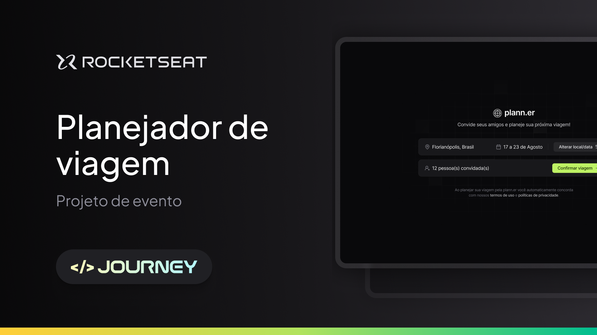
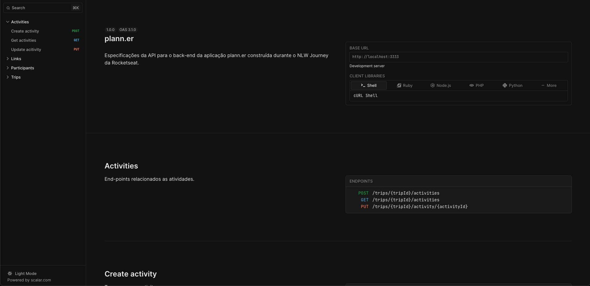
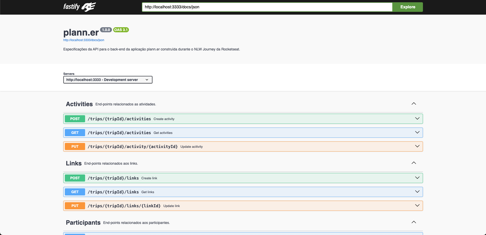

# plann.er - NLW Journey Node.JS



## Explicação sobre o projeto

Neste projeto foi criada uma API em Node.JS para realizar toda a lógica do sistema planejador de viagem. Essa API é responsável por realizar
solicitações e retornar os dados esperados pelo solicitante (Lado cliente).

O usuário agenda a viagem com data e local, podendo convidar outras pessoas, que precisam confirmar ou recusar presença até a data da viagem.
Outras ações poderão ser feitas também, como adicionar atividades relacionadas a viagem com horário em que serão feitas, adicionar links importantes, alterar
o local da viagem e/ou data e gerenciar os convidados.

## Funcionalidades

### Viagem

Esta funcionalide é a primeira disponível durante o acesso ao sistema, onde o usuário precisa escolher um local e a data da viagem, em seguida há uma etapa
para convidar pessoas e confirmar obrigatoriamente seus dados como nome e e-mail.
Após a criação da viagem, ele pode alterá-la, mudando tanto o local quanto a data.

### Participante

Esta ação é feita em primeiro momento durante a criação da viagem e é opcional. Depois pode ser gerenciado dentro da viagem, permitindo cancelar o
convite de um participante ou convidar um novo.

**Obs:** Um convidado pode recusar seu convite.

### Atividade

Aqui é um registro das atividades que serão realizadas durante a viagem, onde deve ser inserido uma breve descrição e a data com horário.

### Link

Nesta opção, é possível adicionar links relacionados a viagem. Por exemplo, o site do anúncio da hospedagem ou o site do restaurante que pretende almoçar.

## Tecnologias utilizadas

- **Node.JS**
- **Typescript**
- **Fastify**
- **Prisma**
- **OpenAPI**
- **NodeMailer**
- **SQLite**

## Rotas

- [x] /trips
- [x] /trips/{tripId}
- [x] /trips/{tripId}/confirm
- [x] /trips/{tripId}/cancel
- [x] /trips/{tripId}/invites
- [x] /trips/{tripId}/participants
- [x] /participants/{participantId}
- [x] /participants/{participantId}/confirm
- [x] /participants/{participantId}/cancel
- [x] /participants/{participantId}/rejects
- [x] /trips/{tripId}/activities
- [x] /trips/{tripId}/activities
- [x] /trips/{tripId}/activity/{activityId}
- [x] /trips/{tripId}/links
- [x] /trips/{tripId}/links/{linkId}

## Documentação de Rotas

A documentação de rotas serve para ilustrar e explicar o que cada uma das rotas fazem, o método e o tipo de conteúdo aceito, quais os parâmetros de entrada permitidos e a especificação do retorno, informando os dados retornados e o tipo de retorno.

### OpenAPI

**Rota:**

```url
/reference
```



### Swagger UI

**Rota:**

```url
/docs
```



## Instruções

Este projeto está pronto para rodar localmente em sua máquina e também para hospedar no [Render](https://render.com/).

Antes de rodar o servidor, é preciso realizar alguns passos importantes para que o projeto funcione da forma correta.

Crie um arquivo **.env** a partir do **.env.example** e faça as seguintes configurações:

```env
DATABASE_URL - Caminho do banco de dados utilizando SQLite
API_BASE_URL - URL da API
WEB_BASE_URL - URL do aplicativo WEB
PLATFORM - Plataforma de hospedagem ("render" ou "local")
PORT - A porta que será utilizada
NODE_ENV - Ambiente de execução ("prod" ou "dev")
DEBUG - Se deverá exibir um registro de execução do projeto
```

Em seguida, devemos instalar os pacotes essenciais.

### _Como efetuo a instalação dos pacotes?_

Execute o comando abaixo:

```node
npm i
```

### _Como posso executar o projeto localmente na minha máquina?_

Execute o comando abaixo:

```node
npm run dev
```

### _Como posso executar o projeto em um ambiente de produção?_

Execute os comandos abaixos:

```node
npm run build
npm run prod
```
